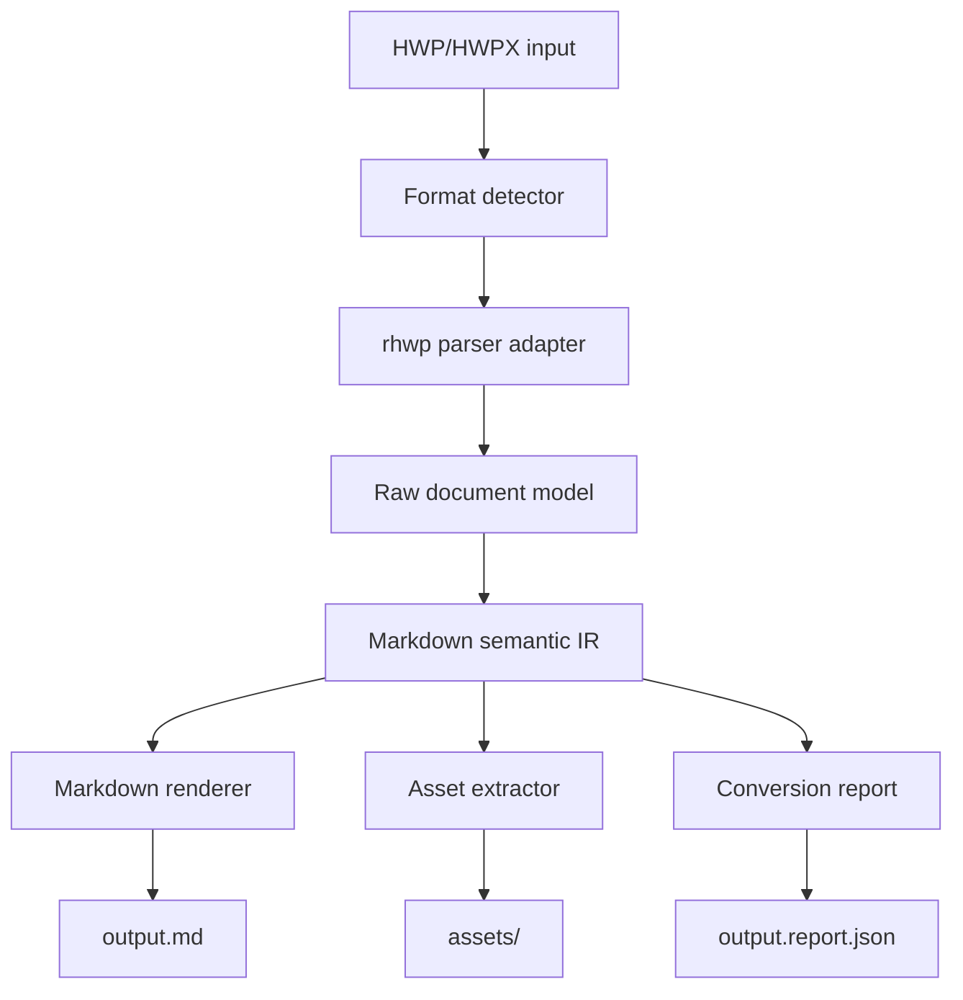

# HWP/HWPX to Markdown 변환기 개발계획서

작성일: 2026-05-11  
대상 산출물: `.hwp` 또는 `.hwpx` 문서를 자연스러운 Markdown 문서와 첨부 자산 폴더로 변환하는 CLI/라이브러리

## 현재 구현 보완 내역

- HWP 표 control과 cell record를 묶어 행/열/병합 정보를 복원하고, 단순 표는 GFM, 병합 표는 HTML fallback으로 출력한다.
- 보도자료 상단 장식 표는 본문에서 제거하되, 배포일시·보도일시·담당부서·담당자를 Markdown frontmatter와 `report.json` metadata에 기록한다.
- HWP inline 제어문자 때문에 `('12)→)→)`처럼 빠지던 연도별 수치 문자열을 보정한다.
- HWP BMP 이미지는 PNG로 변환하고, 공백/괄호가 포함된 자산 경로는 Markdown `<...>` destination으로 출력해 preview 호환성을 높인다.
- 재변환 시 같은 stem의 generated assets를 정리해 이전 `.bmp` 등 잔여 자산이 새 결과와 섞이지 않도록 한다.
- 캡션 직후 HWP 그림 control을 감지하면 이미지 anchor로 기록해 해당 위치에 우선 배치한다.
- HWP 수식 script의 단순 분수 표현은 Markdown 수식 fallback으로 보존하고, 각주 control은 placeholder로 남긴다.
- HWPX inline style 태그가 직접 나타나는 경우 bold/italic/underline/sub/sup HTML/Markdown 표현으로 보존한다.
- `[1]`, `붙임1`, 짧은 `1. 제목`, `가. 제목` 등은 목록이 아니라 heading 후보로 승격한다.
- 수식·각주 등 아직 구조화하지 못한 HWP control id는 `report.json` warning/loss에 남겨 후속 복원 대상을 추적한다.
- `tests/test_hwp2md.py` 회귀 테스트로 파일명 보존, metadata 추출, heading 추론, inline 수치 복원, 자산 링크, BMP 변환, 수식 fallback, assets 정리, 170508 샘플 변환을 검증한다.

## 1. 개발 목표

본 프로젝트의 목표는 한글 문서 파일인 `.hwp`, `.hwpx`를 읽어 문서의 의미 구조를 보존한 Markdown으로 변환하는 프로그램을 만드는 것이다. 여기서 중요한 기준은 한글 문서의 시각적 배치를 픽셀 단위로 재현하는 것이 아니라, 사람이 Markdown으로 다시 읽고 편집하기 자연스러운 제목, 문단, 목록, 표, 이미지, 각주, 수식, 링크, 메타데이터 구조로 변환하는 것이다.

1차 제품은 명령행 도구와 재사용 가능한 변환 라이브러리로 만든다. 이후 필요하면 HOP와 유사한 데스크톱 UI, Obsidian 플러그인, 웹 변환기 등으로 확장한다.

## 2. 참고 저장소 분석

### 2.1 HOP

참고: https://github.com/golbin/hop

HOP는 HWP/HWPX 문서를 열고 편집할 수 있는 오픈소스 데스크톱 앱이며, 내부 문서 엔진은 `rhwp`를 기반으로 한다. README 기준으로 HWP/HWPX 열기, HWP 저장, PDF 내보내기, 인쇄, 파일 드래그 앤 드롭, 파일 연결, 여러 창 열기 같은 제품 기능을 제공한다. 개발 문서에서는 HOP 전용 코드는 `apps/desktop`, `apps/studio-host`에 두고, `third_party/rhwp`는 upstream submodule로 유지하는 경계를 명확히 둔다.

이 프로젝트에서 HOP는 다음 용도로 참고한다.

- `rhwp` 엔진을 제품 계층에서 감싸는 방식
- Tauri 기반 데스크톱 앱으로 확장할 때의 구조
- upstream 엔진을 직접 수정하지 않고 어댑터 계층을 두는 운영 방식
- 파일 열기, 드래그 앤 드롭, 패키징, 릴리즈 검증 항목

### 2.2 rhwp

참고: https://github.com/edwardkim/rhwp

`rhwp`는 Rust + WebAssembly 기반의 HWP/HWPX 뷰어/에디터이다. README 기준으로 HWP 5.0 binary format, HWPX, 섹션, 문단, 표, 텍스트박스, 이미지, 수식, 차트, 머리말/꼬리말, 바탕쪽, 각주/미주 등을 파싱하고 렌더링한다. 내부 구조는 `parser`, `model`, `document_core`, `renderer`, `serializer`, `wasm_api`처럼 문서 엔진 중심으로 나뉘어 있다.

이 프로젝트에서 `rhwp`는 핵심 기반으로 삼는다.

- HWP/HWPX 파서 및 문서 모델 분석
- Markdown 변환 전 단계의 문서 IR 추출
- 표, 수식, 이미지, 페이지/문단 디버깅 도구 참고
- HWPUNIT, 문단/표/LINE_SEG 등 HWP 고유 단위와 구조 해석

단, Markdown 변환은 렌더링 결과물인 SVG/Canvas가 아니라 문서 모델과 레이아웃 정보를 함께 참조하여 수행한다. Markdown은 화면 재현물이 아니라 의미 문서이기 때문이다.

### 2.3 obsidian-hwp-writer

참고: https://github.com/laguna821/obsidian-hwp-writer

`obsidian-hwp-writer`는 Markdown에서 HWPX/DOCX/HTML로 내보내는 Obsidian 플러그인이다. README 기준으로 `pypandoc-hwpx` 기반 HWPX 변환, 템플릿 `.hwpx` 기반 스타일 적용, 라이브 미리보기, Heading 1-9와 Body/Text type별 서식 지정 흐름을 제공한다.

이 프로젝트에서는 반대 방향 변환 규칙을 설계할 때 참고한다.

- Markdown heading, body, list, table이 HWPX 스타일과 대응되는 방식
- Obsidian 친화적인 Markdown 결과물의 기대 형태
- 템플릿/스타일 중심 사고 방식
- Markdown 사용자가 기대하는 편집 가능한 결과물 기준

## 3. 제품 범위

### 3.1 MVP 범위

- 입력: `.hwp`, `.hwpx`
- 출력: `.md` 파일 1개와 이미지/첨부 자산 폴더
- Markdown 방언: 기본 CommonMark + GFM table, 옵션으로 Obsidian 친화 출력
- 주요 변환 대상:
  - 문서 메타데이터
  - 제목/소제목
  - 일반 문단
  - 굵게, 기울임, 밑줄, 취소선 등 일부 인라인 서식
  - 순서/비순서 목록
  - 표
  - 이미지
  - 각주/미주
  - 수식
  - 하이퍼링크
- 명령행 사용 예:

```bash
hwp2md input.hwp -o output.md
hwp2md input.hwpx -o docs/output.md --assets-dir docs/output.assets
hwp2md input.hwp --format obsidian --image-mode extract --table-mode gfm
```

### 3.2 후속 범위

- 여러 문서 일괄 변환
- GUI 앱
- Obsidian 플러그인
- Markdown 변환 품질 리포트
- HWP/HWPX 내부 구조 JSON dump
- OCR 또는 렌더링 기반 보정
- DOCX/PDF 등 추가 출력

### 3.3 제외 범위

- Markdown을 다시 HWP/HWPX로 내보내는 기능
- 한컴 화면과 픽셀 단위로 동일한 Markdown 출력
- 암호화 문서 해제
- 매크로, OLE 삽입 객체, ActiveX 등 실행성 객체 복원
- 모든 레이아웃 속성의 완전 보존

## 4. 핵심 설계 원칙

1. 파싱은 검증된 HWP/HWPX 엔진에 위임한다.
2. Markdown 변환은 별도 계층으로 둔다.
3. 변환의 기준은 시각적 재현보다 의미 구조 보존이다.
4. 원본에서 Markdown으로 표현하기 어려운 정보는 손실시키지 않고 주석, HTML fallback, sidecar JSON 중 하나로 남긴다.
5. 사용자가 편집할 수 없는 거대한 HTML 덩어리를 기본 출력으로 삼지 않는다.
6. 자동 추론은 항상 옵션화하고, 변환 리포트에 근거를 남긴다.
7. 테스트는 실제 공문서, 보고서, 논문, 계약서, 표 중심 문서, 이미지 중심 문서로 나누어 구축한다.

## 5. 권장 아키텍처



### 5.1 모듈 구성

```text
hwp2md/
  crates/
    hwp2md-cli/          # CLI 진입점
    hwp2md-core/         # 변환 파이프라인
    hwp2md-rhwp/         # rhwp 연동 어댑터
    hwp2md-md/           # Markdown 렌더러
    hwp2md-testkit/      # fixture, snapshot, 비교 도구
  docs/
    conversion-rules.md
    fixtures.md
    architecture.md
  fixtures/
    public/
    private/
```

초기 구현 언어는 Rust를 권장한다. `rhwp`가 Rust 기반이고 HWP/HWPX 파싱, 문서 모델, 렌더러와 자연스럽게 연결되기 때문이다. CLI 배포도 단일 바이너리 형태로 유리하다. 웹 또는 Obsidian 연동이 필요해지면 WASM 빌드를 별도 목표로 둔다.

## 6. 변환 파이프라인

### 6.1 입력 감지

- 확장자와 파일 signature를 함께 확인한다.
- `.hwp`: OLE2 Compound File 구조 감지
- `.hwpx`: ZIP/XML 구조 감지
- 잘못된 확장자라도 signature 기반으로 처리한다.
- 암호화 또는 손상 문서는 명확한 에러와 리포트를 출력한다.

### 6.2 Raw Document Model 추출

`rhwp`의 파서와 문서 모델을 사용해 다음 정보를 추출한다.

- 문서 기본 정보: 제목, 작성자, 생성/수정 시간, 페이지 크기
- 섹션 구조
- 문단과 문단 스타일
- 글자 스타일 run
- 번호/글머리표 정보
- 표 구조, 병합 셀, 셀 텍스트
- 이미지 및 바이너리 자산
- 수식 원문 또는 렌더링 가능 표현
- 각주/미주
- 머리말/꼬리말
- 텍스트박스와 도형 내 텍스트

### 6.3 Markdown Semantic IR

Markdown으로 바로 출력하지 않고 중간 의미 IR을 둔다.

```text
Document
  metadata
  blocks[]

Block
  Heading(level, inlines, source)
  Paragraph(inlines)
  List(kind, items, nesting)
  Table(rows, caption, fallback)
  Image(asset_id, alt, caption)
  Equation(source, fallback_image)
  Footnote(id, blocks)
  HorizontalRule
  HtmlBlock(reason, html)
  UnknownBlock(source_ref, diagnostic)

Inline
  Text
  Strong
  Emphasis
  Underline
  Strike
  Code
  Link
  LineBreak
  FootnoteRef
```

이 IR은 테스트와 디버깅을 쉽게 하고, GFM/Obsidian/strict CommonMark 등 출력 방언을 분리할 수 있게 한다.

## 7. 변환 규칙

### 7.1 제목 추론

우선순위는 다음과 같다.

1. HWP/HWPX의 outline 또는 heading 스타일
2. 문단 스타일 이름이 `제목`, `Heading`, `개요`, `목차` 계열인 경우
3. 번호 문단의 outline level
4. 글자 크기, 굵기, 정렬, 앞뒤 간격 기반 휴리스틱

기본값은 보수적으로 한다. 애매한 문단은 제목으로 승격하지 않고 일반 문단으로 둔다. 사용자는 `--heading-policy style|outline|font|none`으로 정책을 선택할 수 있다.

### 7.2 문단

- 연속된 일반 문단은 빈 줄로 구분한다.
- HWP의 강제 줄바꿈은 Markdown hard break 또는 일반 공백으로 변환한다.
- 들여쓰기만 있는 문단은 기본적으로 blockquote로 바꾸지 않는다.
- 중앙/우측 정렬은 기본 Markdown에서는 버리고, `--preserve-align html` 옵션에서만 HTML로 보존한다.

### 7.3 인라인 서식

- bold: `**text**`
- italic: `*text*`
- strike: `~~text~~`
- underline: 기본 Markdown에 없으므로 `<u>text</u>` 또는 plain text 선택
- sub/superscript: `<sub>`, `<sup>` fallback
- 색상/글꼴/자간: 기본 출력에서는 제거하고 리포트에 기록

### 7.4 목록

- 번호/글머리표 속성을 우선 사용한다.
- 문단 앞 문자만 보고 목록을 추론하는 것은 fallback으로 제한한다.
- 다단계 개요 번호는 Markdown 중첩 목록으로 변환한다.
- HWP 특수 글머리표가 Markdown에서 깨질 경우 `-`로 정규화하고 원문 bullet은 리포트에 남긴다.

### 7.5 표

기본은 GFM table이다. 단, 다음 경우에는 HTML table fallback을 사용한다.

- 병합 셀이 있는 경우
- 셀 안에 여러 문단, 목록, 이미지, 표가 있는 경우
- 복잡한 테두리/배경색 보존 옵션이 켜진 경우

옵션:

```bash
--table-mode gfm       # 가능한 표만 GFM, 복잡한 표는 단순화
--table-mode html      # 모든 표를 HTML table로 출력
--table-mode hybrid    # 기본값, 단순 표는 GFM, 복잡한 표는 HTML
```

### 7.6 이미지와 첨부 자산

- 이미지는 `assets/문서명-001.png` 같은 안정적인 이름으로 추출한다.
- Markdown에는 ``로 삽입한다.
- 원본 이미지 형식을 보존하되, 지원이 불안정한 형식은 PNG 변환 옵션을 둔다.
- 이미지 설명은 캡션, 대체 텍스트, 주변 문맥에서 추출한다.

### 7.7 수식

우선순위는 다음과 같다.

1. 수식 원문을 LaTeX 또는 유사 수식 문자열로 변환
2. 변환 불가 시 이미지로 렌더링하고 Markdown image로 삽입
3. 원문과 fallback 정보를 리포트에 기록

옵션:

```bash
--equation-mode latex
--equation-mode image
--equation-mode both
```

### 7.8 각주/미주

- GFM footnote 문법을 사용한다.
- 각주 안에 복합 블록이 있으면 가능한 Markdown으로 풀고, 불가한 구조는 HTML fallback을 사용한다.

```markdown
본문입니다.[^1]

[^1]: 각주 내용입니다.
```

### 7.9 머리말/꼬리말/바탕쪽

기본 출력에서는 본문에 섞지 않는다. 대신 YAML frontmatter 또는 별도 섹션으로 보존한다.

```yaml
---
source: input.hwp
headers:
  - "문서 머리말"
footers:
  - "페이지 꼬리말"
---
```

사용자가 `--include-page-artifacts`를 지정하면 문서 끝에 부록으로 출력한다.

### 7.10 텍스트박스와 도형 텍스트

- 본문 흐름 안에 있는 텍스트박스는 blockquote 또는 별도 문단으로 변환한다.
- 위치 기반 부유 객체는 본문 삽입 위치를 추정하되, 불확실하면 가장 가까운 문단 뒤에 배치한다.
- 복잡한 도형 자체는 이미지 fallback 또는 리포트 항목으로 남긴다.

## 8. CLI 설계

### 8.1 기본 명령

```bash
hwp2md <input> [options]
```

### 8.2 주요 옵션

```bash
-o, --output <path>             출력 Markdown 경로
--assets-dir <path>             이미지/첨부 자산 폴더
--format <gfm|commonmark|obsidian>
--heading-policy <style|outline|font|none>
--table-mode <gfm|html|hybrid>
--image-mode <extract|embed|skip>
--equation-mode <latex|image|both|skip>
--frontmatter <none|yaml>
--include-page-artifacts
--report <path>
--strict                         손실 가능성이 큰 항목을 에러로 처리
--batch <glob>
```

### 8.3 예시 출력 구조

```text
report.md
report.assets/
  report-001.png
  report-002.jpg
report.report.json
```

## 9. 라이브러리 API 설계

```rust
pub struct ConvertOptions {
    pub markdown_format: MarkdownFormat,
    pub heading_policy: HeadingPolicy,
    pub table_mode: TableMode,
    pub image_mode: ImageMode,
    pub equation_mode: EquationMode,
    pub frontmatter: FrontmatterMode,
}

pub struct ConvertResult {
    pub markdown: String,
    pub assets: Vec<Asset>,
    pub report: ConversionReport,
}

pub fn convert_file(path: &Path, options: ConvertOptions) -> Result<ConvertResult>;
```

API는 CLI, GUI, 플러그인, 서버 변환기에서 동일하게 재사용할 수 있게 설계한다.

## 10. 개발 단계

### Phase 0. 기술 검증

기간: 1주

- `rhwp` 소스와 라이선스 검토
- HWP/HWPX 샘플 20개 수집
- `.hwp`, `.hwpx` 로딩 성공률 확인
- `rhwp` 문서 모델에서 Markdown 변환에 필요한 필드 접근 가능성 확인
- 단순 문서 1개를 수동 IR dump로 변환해 목표 품질 정의

완료 기준:

- 샘플 문서 80% 이상 파싱 가능
- 문단, 표, 이미지, 각주, 수식 중 최소 3종 이상 추출 경로 확인
- 변환 규칙 초안 작성

### Phase 1. 프로젝트 골격과 기본 CLI

기간: 1주

- Rust workspace 생성
- CLI 인자 파서 구성
- 입력 감지와 에러 모델 구현
- `rhwp` adapter crate 구성
- `dump-ir` 개발자 명령 추가

완료 기준:

- `hwp2md sample.hwp -o sample.md` 명령이 동작
- 실패 시 원인과 처리 가능한 다음 행동을 출력
- CI에서 build/test/lint 실행

### Phase 2. 기본 Markdown 변환

기간: 2주

- 문단 변환
- heading 추론
- 기본 인라인 서식 변환
- 목록 변환
- YAML frontmatter 출력
- snapshot 테스트 구축

완료 기준:

- 텍스트 중심 문서 10개에서 사람이 읽을 수 있는 Markdown 생성
- 제목/문단/목록 snapshot 테스트 통과
- 변환 리포트에 손실 항목 기록

### Phase 3. 표, 이미지, 각주

기간: 2주

- 단순 표 GFM 변환
- 복잡한 표 HTML fallback
- 이미지 추출과 경로 생성
- 각주/미주 변환
- asset naming 안정화

완료 기준:

- 표 중심 문서 10개에서 크래시 없이 변환
- 이미지가 누락 없이 assets 폴더에 저장
- 병합 셀 포함 표의 fallback 정책 검증

### Phase 4. 수식과 복잡 객체

기간: 2주

- 수식 원문 추출
- LaTeX 변환 가능성 검토
- 이미지 fallback 구현
- 텍스트박스/도형 텍스트 처리
- 머리말/꼬리말/바탕쪽 보존 옵션 구현

완료 기준:

- 수식 포함 문서에서 최소 fallback 이미지 또는 원문 보존
- 텍스트박스 내용 누락률 측정
- 변환 리포트가 누락 가능 객체를 명시

### Phase 5. 품질 개선과 배포

기간: 2주

- Windows/macOS/Linux 빌드
- 대용량 문서 성능 측정
- batch 변환
- README, 사용 가이드, 변환 규칙 문서 작성
- 샘플 변환 결과 공개

완료 기준:

- 100페이지급 문서 변환 성공
- 100개 샘플 일괄 변환 중 크래시 0건
- GitHub Release 또는 내부 배포 패키지 생성

## 11. 테스트 전략

### 11.1 fixture 분류

- 텍스트 중심 보고서
- 표 중심 공문서
- 이미지 포함 제안서
- 수식 포함 논문/과제 문서
- 머리말/꼬리말 포함 문서
- 각주/미주 포함 문서
- 다단 문서
- 손상 또는 암호화 문서

### 11.2 테스트 유형

- 단위 테스트: heading 추론, table 변환, inline escape
- snapshot 테스트: Markdown 출력 고정
- golden 테스트: 샘플 문서별 기대 Markdown 비교
- property 테스트: Markdown escape 안정성
- 회귀 테스트: 변환 중 panic/crash 방지
- 성능 테스트: 페이지 수, 이미지 수, 표 크기별 처리 시간

### 11.3 품질 지표

- 파싱 성공률
- 텍스트 추출 완전성
- 표 구조 보존율
- 이미지 추출 성공률
- 각주/수식 보존율
- Markdown lint 통과율
- 수동 검수 점수

## 12. 변환 리포트 설계

Markdown만 출력하면 손실 여부를 알기 어렵다. 따라서 기본적으로 `output.report.json`을 생성한다.

```json
{
  "source": "input.hwp",
  "format": "hwp",
  "pages": 12,
  "blocks": 180,
  "assets": 8,
  "warnings": [
    {
      "code": "TABLE_HTML_FALLBACK",
      "message": "Merged cells require HTML table fallback",
      "sourceRef": "section=0 paragraph=34"
    }
  ],
  "losses": [
    {
      "code": "TEXT_COLOR_DROPPED",
      "count": 12
    }
  ]
}
```

## 13. 주요 위험과 대응

| 위험 | 영향 | 대응 |
| --- | --- | --- |
| `rhwp` 내부 API 변경 | adapter 깨짐 | `hwp2md-rhwp`를 얇은 경계로 두고 버전 pinning |
| 복잡한 HWP 레이아웃 | Markdown 표현 한계 | semantic 우선, HTML fallback, report 기록 |
| 제목 추론 오류 | 문서 구조 품질 저하 | 기본은 보수적 정책, 옵션 제공, 스타일 기반 우선 |
| 병합 표/중첩 표 | GFM table 불가 | HTML table fallback |
| 이미지/수식 누락 | 정보 손실 | asset extractor와 strict 모드 |
| 비공개 업무 문서 테스트 어려움 | fixture 부족 | 공개 샘플, 합성 문서, 로컬 private fixture 분리 |
| 라이선스/상표 이슈 | 배포 위험 | MIT 라이선스 확인, 한컴 비제휴 고지, 상표 표기 |

## 14. 라이선스와 고지

참고 저장소는 MIT 라이선스 계열로 보이지만, 실제 vendoring 또는 코드 재사용 전 각 저장소의 `LICENSE`와 포함된 third-party license를 다시 확인한다. 제품 README에는 다음 고지를 둔다.

- 본 프로젝트는 한글과컴퓨터와 제휴, 후원, 승인 관계가 없는 독립 오픈소스 프로젝트이다.
- "한글", "한컴", "HWP", "HWPX" 등 상표는 각 권리자에게 귀속된다.
- 변환 결과는 원본 문서의 모든 레이아웃을 보장하지 않으며, 제출 전 사용자가 검수해야 한다.

## 15. 초기 작업 목록

1. 저장소 초기화 및 Rust workspace 생성
2. `rhwp`를 submodule 또는 git dependency로 연결하는 방식 결정
3. 공개 샘플 문서 수집
4. `dump-ir` 명령 구현
5. 문단/제목/인라인 기본 변환 구현
6. GFM Markdown snapshot 테스트 구축
7. 표/이미지/각주 순서로 기능 확장
8. 변환 리포트와 strict 모드 구현
9. README와 변환 규칙 문서 작성
10. v0.1.0 CLI 배포

## 16. v0.1.0 목표 정의

v0.1.0은 "완벽한 변환기"가 아니라 "실제 문서를 Markdown 초안으로 안정적으로 바꾸는 도구"를 목표로 한다.

필수 조건:

- HWP/HWPX 입력을 자동 감지한다.
- 텍스트, 제목, 문단, 목록을 Markdown으로 출력한다.
- 단순 표를 GFM table로 출력한다.
- 이미지를 assets 폴더로 추출한다.
- 변환 리포트를 생성한다.
- 변환 실패 시 panic 없이 진단 메시지를 출력한다.

성공 기준:

- 공개/합성 fixture 50개 중 45개 이상 변환 성공
- 텍스트 중심 문서의 본문 누락이 거의 없음
- 표/이미지 누락은 report에 기록됨
- Windows에서 단일 바이너리로 실행 가능

## 17. 장기 확장 방향

- `hwp2md serve`: 로컬 웹 UI
- `hwp2md watch`: 폴더 감시 후 자동 변환
- Obsidian 플러그인: vault 안에서 HWP/HWPX import
- HOP 통합: HOP에서 "Markdown으로 내보내기" 메뉴 추가
- Markdown to HWPX와의 왕복 테스트: obsidian-hwp-writer/pypandoc-hwpx와 비교
- AI 보정 옵션: 제목 추론, 표 캡션 추론, 이미지 alt 생성

## 18. 참고 링크

- HOP: https://github.com/golbin/hop
- HOP 개발 문서: https://github.com/golbin/hop/blob/main/docs/DEVELOPMENT.md
- HOP upstream 경계 문서: https://github.com/golbin/hop/blob/main/docs/architecture/UPSTREAM.md
- rhwp: https://github.com/edwardkim/rhwp
- obsidian-hwp-writer: https://github.com/laguna821/obsidian-hwp-writer
